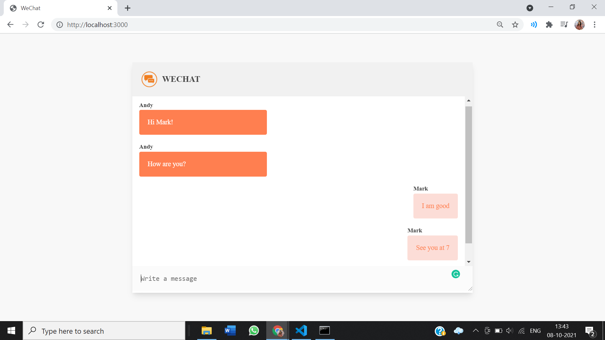

# WeChat- A Real Time Messaging App
### It has been created using node JS and socket.io
1. User is prompted to enter their username    
    
2. After that users can type their message and press enter to send    
     
3. Users can communicate in real time    
    
